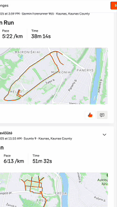

# Strava kudos bot 🏃‍♂️⭐

An automated bot that gives kudos to activities on your Strava dashboard feed. Built with Python and Playwright for reliable browser automation.

## Demo



## Features

✅ **Automatic kudos**: Automatically likes activities in your Strava feed  
✅ **Persistent login**: Saves your login session for seamless operation  
✅ **Smart scrolling**: Scrolls through your feed to reach more activities  
✅ **Athlete filtering**: Skip kudos for specific athletes (yourself for example)  
✅ **Continuous operation**: Runs in intervals to catch new activities  

## Prerequisites

- Python 3.12
- pip
- Chrome browser installed on your system

## Installation

### Quick Setup

Use the provided setup script for automatic installation:

```bash
chmod +x setup.sh
./setup.sh
```

### Manual Setup

1. **Clone the repository**:
   ```bash
   git clone https://github.com/yourusername/strava-kudos-bot.git
   cd strava-kudos-bot
   ```

2. **Install Python dependencies**:
   ```bash
   pip3 install -r requirements.txt
   ```

3. **Install Playwright browsers**:
   ```bash
   playwright install chromium
   ```

## Configuration

Before running the bot, set up your configuration:

1. **Copy the example configuration file**:
   ```bash
   cp .env.example .env
   ```

2. **Edit `.env`** with your preferences:
   ```bash
   # Number of times to scroll to the bottom of the feed
   NUMBER_OF_SCROLLS_TO_END=5
   
   # Wait time between cycles in seconds (3600 = 1 hour)
   INTERVAL_SECONDS=3600
   
   # Comma-separated list of athlete names to skip
   ATHLETES_TO_SKIP=YourName,Friend1,Friend2
   ```

## Usage

### Basic Usage

Run the bot:

```bash
python3 bot.py
```

### First Run

On the first run:
1. The bot will load configuration from `.env`
2. Open a Chrome browser window
3. Navigate to Strava login page
4. You'll have 50 seconds to manually log in if automatic login doesn't work
5. After login, the bot will start giving kudos automatically

### Configuration Options

Edit `.env` to customize:

- **`NUMBER_OF_SCROLLS_TO_END`**: How many times to scroll through the feed before waiting (default: 5)
- **`INTERVAL_SECONDS`**: Time in seconds between cycles (default: 3600 = 1 hour)
- **`ATHLETES_TO_SKIP`**: Comma-separated list of athlete names to skip (case-insensitive, partial matching)

## Project Structure

```
strava-kudos-bot/
├── bot.py
├── browser_manager.py
├── .env
├── .env.example
├── requirements.txt
├── setup.sh
├── .gitignore
├── LICENSE
├── README.md
├── media/
│ └── strava_kudos_bot.gif
└── playwright-state/
```

## Key Components

### `BrowserManager`
Singleton class managing the Playwright browser instance with persistent context for maintaining login sessions.

### `CustomPage`
Wrapper around Playwright's Page with Strava-specific methods:
- `accept_cookies()`: Handles cookie consent
- `do_login()`: Automates login process
- `give_kudos()`: Finds and clicks kudos buttons
- `execute_kudos_giving()`: Main loop for continuous operation
- `scroll_to_bottom_of_page()`: Loads more activities

## Important Notes

⚠️ **Rate Limiting**: Be mindful of Strava's rate limits. The bot includes delays to avoid overwhelming the server.

⚠️ **Terms of Service**: This bot automates browser interactions with Strava. Use responsibly and ensure compliance with [Strava's Terms of Service](https://www.strava.com/legal/terms).

⚠️ **Educational Purpose**: This project is intended for educational purposes and personal use only.

## Dependencies

- **playwright** (>=1.56.0): Browser automation framework
- **python-dotenv** (>=1.0.0): Environment variable management

## License

This project is open source and available under the [MIT License](LICENSE).

## Disclaimer

This bot is not affiliated with, endorsed by, or in any way officially connected to Strava, Inc. Use at your own risk. The authors are not responsible for any consequences of using this bot, including but not limited to account suspension or termination.

---

**Star ⭐ this repo if you find it useful!**


